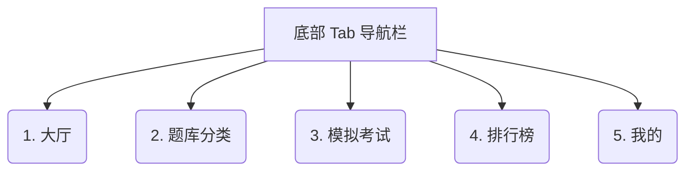
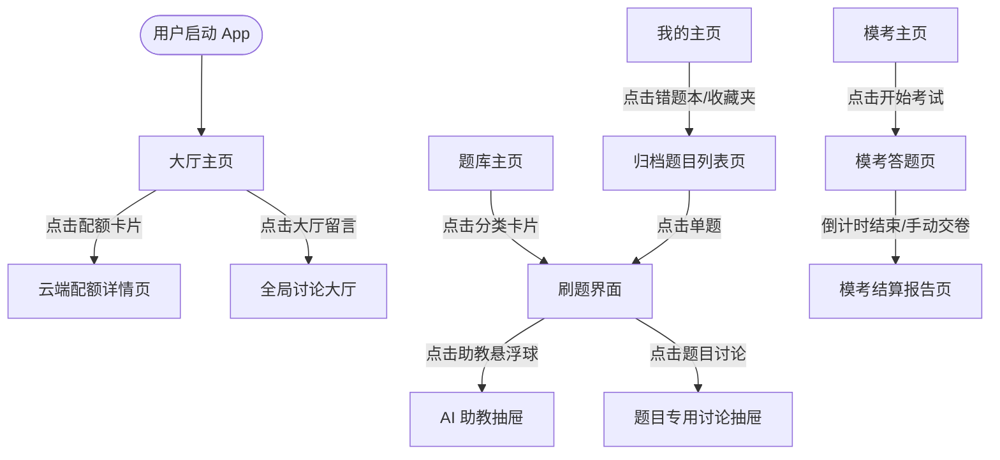

# 📱 离散数学刷题系统 - 移动端功能与界面设计规约文档

本规约文档旨在为“离散数学刷题系统”的移动端（iOS / Android）原型设计、前端开发及接口对接提供详尽的标准说明。

---

## 1. 文档信息
* **项目名称**：离散数学在线刷题系统（移动版）
* **版本**：v1.0.0
* **编写日期**：2026-06-28
* **目标读者**：产品经理、前端开发工程师、UI/UX 设计师、测试工程师

---

## 2. 产品定位与核心价值
本系统是一套面向离散数学学习者的**移动端边缘计算刷题系统**，旨在提供轻量、流畅且具备 AI 启发式辅导的移动学习体验。

### 🚀 核心价值主张 (Wedge)
* **苏格拉底式 AI 助教**：集成流式 AI（Llama 3.3），采用启发式对话拒绝直接给答案，引导用户自行推导，支持 LaTeX 公式排版与思维链展示。
* **边缘计算透明度**：在客户端直接展示 Cloudflare 接口配额（Workers/Pages/AI Neurons），保障公开透明的开源运行指标。
* **双色自适应**：原生支持深浅色模式平滑过渡，为夜间刷题提供舒适的暗光视觉保护。

---

## 3. 信息架构与页面流转

### 3.1 底部导航结构
本 App 采用底部固定双色自适应 Tab 栏进行页面切换：



### 3.2 页面关系与跳转流图
用户进入 App 后的整体页面流转路径如下：



---

## 4. 页面级详细功能与交互要求

### 4.1 【大厅】主页 (Lobby View)
* **配额看板**：
  * **今日 Workers/Pages 请求数进度条**：显示今日已用请求总数（上限 100,000 次），细分静态 Pages 资源和 API Workers 消耗，并附北京时间早 8:00 重置的倒计时。
  * **今日 AI 算力进度条**：展示今日 AI 助教已消耗算力值（上限 10,000 Neurons）。
* **刷题数据看板**：
  * 采用 4 宫格或水平滑动卡片，展示“题库总量”、“已答题目”、“平均正确率”、“今日刷题耗时”。
* **科目掌握度面板**：
  * 以彩色进度条展示五大科目（命题逻辑、谓词逻辑、集合论、二元关系、图论）的掌握度。
  * **计算公式**：$\text{掌握度} = \frac{\text{该科做对题目数}}{\text{该科总题目数}} \times 100\%$。

### 4.2 【题库】主页 (Category Selection)
* **快捷设置栏**：
  * 提供 3 个快捷开关：
    * **自动下一题**：开启后，作答正确展示解析并停留 1.5 秒后，自动滑入下一题。
    * **随机乱序**：开启后，打乱该科目题目顺序。
    * **隐藏已做对题**：开启后，不再显示已掌握的题目。
* **题型选择卡片**：
  * 展示 5 大模块卡片（包含科目题数进度，如：`集合论 (32/150 题)`）。点击直接进入刷题界面。

### 4.3 【刷题界面】二级页 (Practice View)
* **题目渲染卡片**：
  * 顶部展示分类标签、难度等级角标（易、中、难）以及收藏按钮（五角星）。
  * 题干部分需完整渲染标准的 LaTeX 数学公式（基于 KaTeX 引擎）与 Markdown 文本。
* **答题区域**：
  * **判断题**：显示“正确”与“错误”两个磁贴式按钮。
  * **单选题/多选题**：A、B、C、D 选项圆角卡片，点击带缩放微动效。
  * **填空题**：单行文本框。
  * **主观题**：多行文本框，支持输入推理步骤。
* **反馈抽屉 (Feedback Sheet)**：
  * 提交后向上弹出，正确为“森林绿（#2E7D32）”背景，错误为“胭脂红（#C62828）”背景。
  * 展示标准答案及包含详尽推导定理的解析文本。

### 4.4 【模考】主页与答题页 (Exam Session)
* **考前准备**：展示规则，点击“开始考试”后无缝切换至全屏答题页。
* **考试进行**：
  * 顶部锁定倒计时（60分钟，倒计时在 5 分钟内时红色高亮闪烁）。
  * 底部提供【答题卡】向上滑动抽屉，显示所有 20 道题的作答标记。
* **考后结算**：展示分数（满分 100 分）、环形正确率图表、答题耗时、错题列表。支持一键“同步到排行榜”。

### 4.5 【排行榜】与【我的】主页 (Leaderboard & Profile)
* **排行榜**：
  * 排名前 50 名列表，前三名显示金银铜牌。
  * 排序规则优先级：1. 模拟考试最高分 -> 2. 已答题总量 -> 3. 平均正确率。
* **我的**：
  * 错题本入口与收藏夹入口（点击跳转至卡片式列表页，支持侧滑删除/移出）。
  * 云端同步模块：显示最新同步时间戳，支持“一键强制同步”。
  * 凭证设置：点击可输入 Cloudflare 账户 ID 与 API Token。

---

## 5. 对话框与辅助组件设计

### 5.1 AI 智能助教底栏抽屉 (Floating AI Tutor Bottom Sheet)
> [!IMPORTANT]
> 移动端由于屏幕限制，AI 助教采用底部抽屉形式。点击悬浮球后向上滑出，默认高度为屏幕的 60%，支持拖动至全屏。

* **启发式教学控制**：
  * 提供“显示思考链 (Show Thinking)”开关。勾选时，AI 的折叠思考日志 `<think>` 会展示在回答气泡最上方。
  * 预设追问快捷键：【提供一步步提示】、【讲解涉及定理原理】。
  * 文本流式 SSE 打字机输出，公式实时 KaTeX 编译。

### 5.2 账户注销二次确认弹窗 (Delete Account Overlay)
> [!CAUTION]
> 账户注销是高风险操作，必须进行防误触防御性交互设计。

* **设计要求**：
  * 弹窗内明确标红展示资产损失警告。
  * 提供一个输入框，用户必须手动键入其“登录用户名”，此时“确认注销”按钮才解除禁用。
  * 确认后调用 `POST /api/auth/delete` 接口永久抹除记录并清除本地 LocalStorage。

### 5.3 登录 / 注册弹窗 (Auth Dialog)
* 支持在单弹窗内通过顶部标签（Tab）平滑左右滑动切换登录与注册面板。
* 前端需要对“用户名为空”、“密码长度少于 6 位”、“两次密码不一致”进行实时微交互报错提示。

---

## 6. 数据同步规约 (Data Integration Spec)

本系统的核心数据结构与接口调用逻辑定义如下：

### 6.1 用户画像与答题数据结构
```json
{
  "profile": {
    "userId": "usr_9f8d1c...",
    "username": "example_user",
    "answeredCount": 12,
    "correctRate": 83,
    "examHighScore": 90,
    "updatedAt": 1782619763
  },
  "data": {
    "bookmarks": ["q1", "q5"],
    "wrongQuestions": ["q3"],
    "answered": {
      "q1": { "isCorrect": true, "userAnswer": "A", "timestamp": 1782619760 },
      "q3": { "isCorrect": false, "userAnswer": "B", "timestamp": 1782619762 }
    }
  }
}
```

### 6.2 异常防御设计原则
1. **网络连接异常**：
   * 离线状态下，App 自动降级为“本地缓存模式”，所有答题进度与错题先暂存在 LocalStorage。
   * 检测到网络恢复时，顶栏弹出提示条：“检测到网络已恢复，正在同步离线数据...”，自动调用 `POST /api/progress` 同步至云端。
2. **留言过滤限制**：
   * 留言输入组件限制最大字数为 200 字，且发送前进行前端敏感词及空格过滤。
   * 单题讨论上限 50 条，后端采取环形队列式覆盖写入。
